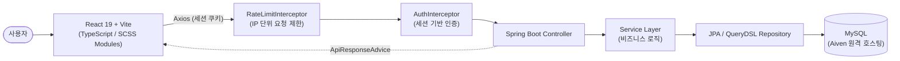
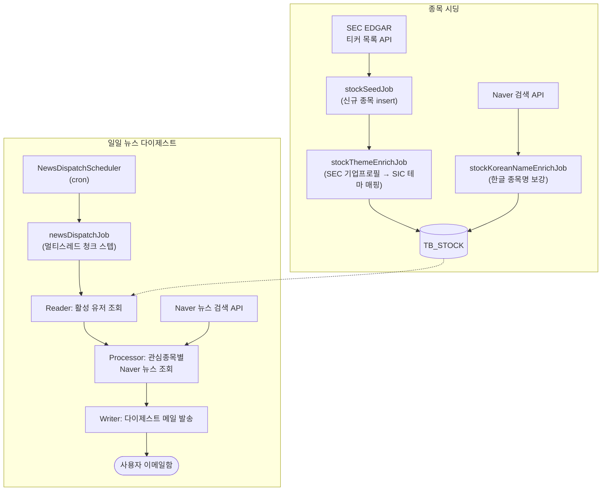
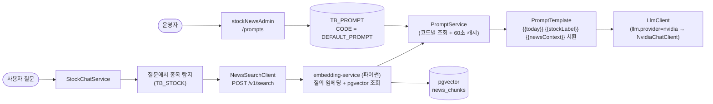

# Project

## 아키텍처

### 요청 흐름 (동기 API)



### API 요청 제한 (IP 단위)

같은 IP에서 짧은 시간에 몰려오는 요청을 컨트롤러 진입 전에 잘라낸다. 특히 호출 1건마다 실제 비용이
나가는 경로(`POST /stocks/chat` → NVIDIA LLM 토큰, `/auth/**`의 메일 발송)를 보호하는 것이 목적이다.

- 대상: `/auth/**`, `/stocks/**`, `/users/me/**` (SPA 정적 리소스는 제외)
- 방식: IP별 토큰 버킷(Bucket4j) + Caffeine 보관(유휴 만료·개수 상한). 앱 인스턴스가 1대라 인메모리로
  두었고, 인스턴스를 늘릴 때는 `RateLimiter` 구현만 Redis로 교체하면 된다.
- 한도 초과 시 `HTTP 429` + `{"code":"TOO_MANY_REQUESTS"}` + `Retry-After` 헤더
- 설정: `rate-limit.*` (env `RATE_LIMIT_ENABLED`, `RATE_LIMIT_CAPACITY`, `RATE_LIMIT_REFILL_PERIOD`).
  오탐이 나면 `RATE_LIMIT_ENABLED=false`로 재배포 없이 끌 수 있다.
- 클라이언트 IP: `X-Forwarded-For`를 **뒤에서부터** 읽는다(`rate-limit.trusted-proxy-count`, prod=1).
  Spring의 `forward-headers-strategy`는 헤더의 첫 값을 쓰는데, 프록시는 들어온 헤더를 지우지 않고
  뒤에 이어붙이므로 클라이언트가 앞쪽 값을 위조해 제한을 통째로 우회할 수 있다. 프록시가 마지막에
  덧붙인 값만 위조 불가능하다. 프록시가 없는 환경은 0으로 두어 헤더를 아예 믿지 않는다.
  전제로 앱 포트는 리버스 프록시 외에 노출하지 않아야 한다(프록시를 우회하면 이 판별이 무의미해진다).
- `POST /stocks/chat`은 세션 인증 필수. 프론트가 비로그인 시 입력창을 비활성화하지만 화면 가드일 뿐이라
  서버에서도 막는다.

### 배치 흐름 (종목 시딩 · 뉴스 발송)



- 종목 시딩/보강 배치는 단일 tasklet 위주(순차 처리), 뉴스 발송 배치만 유저를 20명 단위 청크로 나눠 스레드풀(`newsDispatchTaskExecutor`)에서 병렬 처리.
- 발송 결과는 유저·슬롯 단위로 `TB_MAIL_DISPATCH_LOG`에 남긴다(SUCCESS / FAILED / 보낼 뉴스가 없어 건너뛴 SKIPPED). 어드민(stockNewsAdmin) 발송현황·대시보드가 이 테이블을 읽는다. 발송 실패로 청크가 롤백돼도 기록이 남도록 별도 트랜잭션으로 쓰고, 재처리 시 같은 슬롯 기록은 마지막 결과로 덮어쓴다. 테스트 발송(`POST /users/me/news-mail/test`)은 운영 통계를 흐리지 않도록 기록하지 않는다.
- 각 배치는 `*Scheduler`가 cron으로 트리거하며, 애플리케이션 기동 시 자동 실행되지 않음(`BatchJobLauncherAutoConfiguration` 제외).
- `POST /users/me/news-mail/test` — 로그인한 본인에게 뉴스 다이제스트 메일을 즉시 테스트 발송(발송시간대/발송여부 설정 무시, 유저당 1분 쿨다운). 발송 배치를 기다리지 않고 메일 형식·SMTP 설정을 확인할 때 사용.
- `newsEmbeddingJob`(`NewsEmbeddingScheduler`, `news.embedding.cron`) — `TB_STOCK_NEWS`에서 `EMBEDDED_AT IS NULL`인 뉴스를 10건씩 묶어 내부 임베딩 서비스(`POST {news.embedding.base-url}/v1/news`)로 넘기고, 200을 받은 묶음만 `EMBEDDED_AT`을 찍어 큐에서 뺀다. 상태 코드가 계약이라 건별 결과는 보지 않으며(200=묶음 전체 완료, 503=서비스 미준비라 조용히 종료, 그 외 오류=잡 실패 후 다음 주기 재전송), 서비스가 `news_id` 기준 upsert라 재전송해도 중복 적재되지 않는다. 한 실행은 `news.embedding.max-batches-per-run` 묶음까지만 처리한다.

### 챗봇 프롬프트 (DB 소싱)



- 챗봇 시스템 프롬프트는 코드가 아니라 어드민이 `TB_PROMPT`에 등록한 본문을 쓴다(`PromptCode.STOCK_CHAT_SYSTEM` → `TB_PROMPT.CODE = DEFAULT_PROMPT`). 프롬프트를 고치는 데 배포가 필요 없다.
- 본문의 `{{today}}`(오늘 날짜) / `{{stockLabel}}`(질문에서 찾은 종목) / `{{newsContext}}`(질문과 의미가 가까운 뉴스)는 요청마다 실제 값으로 치환되고, `{{#newsContext}}...{{/newsContext}}` 구간은 값이 있을 때만 남는다.
- `{{newsContext}}`는 최신순이 아니라 **의미 유사도순**이다. 질문 문장을 임베딩 서비스에 넘겨(`NewsVectorSearchService` → `NewsSearchClient`) 의미가 가까운 뉴스를 받아 제목과 본문 청크를 함께 넣는다. 종목을 못 찾은 질문은 종목 필터 없이 전체에서 찾는다.
- 검색이 실패하거나 서비스가 아직 안 떴으면(503) 예외 대신 빈 컨텍스트로 떨어져, 뉴스 근거 없이 답변한다 — 검색 실패가 챗봇 실패가 되지 않는다.

### 챗봇 LLM 제공자 (LlmClient)

LLM 호출은 `LlmClient` 인터페이스(`chat(systemPrompt, userMessage)`) 뒤에 있고, `llm.provider`(env `LLM_PROVIDER`)가 구현체 하나를 고른다. 서비스 코드는 어느 제공자인지 모른다.

| provider | 구현체 | 비고 |
|---|---|---|
| `nvidia` | `NvidiaChatClient` | NVIDIA NIM 무료 티어. 모델 단종/권한없음/5xx면 `fallback-models`로 순차 폴백. 무료 큐잉으로 60~120초 지연이 잦다 |
| `anthropic` | `ClaudeChatClient` | 공식 Java SDK. `ANTHROPIC_MODEL`(기본 `claude-opus-5`), `ANTHROPIC_EFFORT`(기본 `low`). 안전 거절(`stop_reason=refusal`)은 실패로 처리 |
| `openai` (기본) | `GptClient` | Chat Completions 직접 호출. `OPENAI_MODEL`(기본 `gpt-5-mini`), `OPENAI_REASONING_EFFORT`(기본 `low`). GPT-5 계열 제약 반영: `max_completion_tokens` 사용, `temperature`/`top_p` 미전송, `reasoning_effort` 명시 |

실패는 전부 `LlmException`으로 올라와 `STOCK_CHAT_FAILED`가 된다. 새 제공자는 `LlmClient` 구현체에 `@ConditionalOnProperty(prefix = "llm", name = ["provider"], havingValue = "<이름>")`을 붙이고 env만 바꾸면 붙는다.

### 챗봇 RAG (벡터 검색)

**임베딩도 벡터 DB도 이 애플리케이션의 일이 아니다.** 뉴스 적재(`POST /v1/news`)와 질의 검색(`POST /v1/search`) 모두 형제 파이썬 프로젝트(`embedding-service`)가 담당하고, 이 앱은 질문 문장을 넘기고 기사 목록을 받는다.

- 호출은 `NewsSearchClient` 하나다. 요청은 `{query, stock_id, limit}`, 응답은 `{articles: [{news_id, title, content, url, score}]}`. 벡터(1024차원 float)는 주고받지 않는다.
- **타임아웃이 적재용과 다르다.** 적재(`NewsEmbeddingClient`)는 배치라 read-timeout 3분이지만, 검색은 사용자가 화면 앞에서 기다리는 경로라 2초/5초다. 늦으면 뉴스 근거를 포기하고 답변을 진행하는 편이 낫다.
- 503(서비스 미준비·벡터 DB 미연결)은 장애가 아니라 "지금은 못 준다"라서 빈 결과로 떨어진다. 그 외 실패도 `NewsVectorSearchService`가 삼킨다.
- `article-limit`(프롬프트에 넣을 기사 수)만 이 앱이 정한다. 유사도 하한은 보내지 않는다 — 인덱스와 모델을 가진 쪽이 정하는 게 맞고, 실측상 그 값은 관련성 필터 구실을 못 한다(무관한 질문이 관련 질문보다 높은 점수를 받는다). 자세한 근거는 `embedding-service`의 `ARCHITECTURE.md` 참고.
- 프리픽스(`query: ` / `passage: `)도 저쪽이 붙인다. 여기서 질문을 가공하면 이중으로 붙어 검색 품질이 조용히 망가진다.
- **이 앱은 벡터 DB에 직접 붙지 않는다.** DataSource는 MariaDB 하나뿐이고 Boot 자동설정이 그대로 동작한다. 예전에는 질의 임베딩 모델(535MB ONNX)을 JVM에 올리고 pgvector에 두 번째 DataSource로 붙었는데, 모델 가중치가 힙이 아니라 네이티브 메모리에 잡혀 `-Xmx`로 통제되지 않았다 — 컨테이너가 `mem_limit` 3g의 99.94%를 점유하고 469MB가 스왑으로 밀려났으며 배포 후 첫 질문이 206초 걸렸다. 지금은 `mem_limit: 2g` / `-Xmx1200m`이다.

- 행이 없거나 `ENABLED=0`이거나 DB 조회가 실패하면 코드에 들고 있는 기본 프롬프트(`PromptCode.fallback`)로 동작한다 — 어드민 설정 실수로 챗봇이 멈추지 않는다.
- 조회 결과는 `prompt.cache-ttl-seconds`(기본 60초) 동안 캐싱되므로 어드민 수정은 최대 그만큼 뒤에 반영된다.

## 프론트엔드

---

## 기술 스택

- React
- TypeScript
- SCSS
- Vite
- Axios
- React Router
- Lucide React
- Zustand

---

## 개발 환경

- Node.js
- npm
- Vite
- Visual Studio Code

---

## 설치 라이브러리

### Sass

```bash
npm install sass
```

SCSS 문법을 사용하기 위한 라이브러리

- 공통 변수 관리
- 공통 믹스인 관리
- 페이지별 스타일 관리
- 중첩 문법 사용

#### 현재 프로젝트의 Sass 설치

현재 프로젝트는 Vite에서 권장하는 `sass-embedded`를 사용

```bash
npm install -D sass-embedded
```

`sass`와 `sass-embedded`는 같은 SCSS 파일을 처리하므로 둘 다 설치하지 않음

실제 스타일을 만드는 전역 SCSS는 `main.tsx`에서 한 번만 불러옵니다.

```tsx
import '@/assets/styles/common/reset.scss'
import '@/assets/styles/common/common.scss'
```

변수와 믹스인처럼 SCSS 작성을 도와주는 파일은 Vite의 `additionalData`에 등록

```ts
additionalData: `
  @use "@/assets/styles/common/variable.scss" as *;
`,
```

나중에 `mixin.scss`를 만들면 같은 방법으로 `additionalData`에 등록

### Axios

```bash
npm install axios
```

서버 API에 데이터를 요청하거나 전달할 때 사용

```ts
axios.get('/api/news')
```

### Lucide React

```bash
npm install lucide-react
```

React 컴포넌트 방식으로 아이콘을 사용하기 위한 라이브러리

```tsx
import { Search } from 'lucide-react'

function SearchButton() {
  return (
    <button type="button">
      <Search />
      검색
    </button>
  )
}
```

### Zustand

```bash
npm install zustand
```

여러 컴포넌트/페이지가 함께 쓰는 전역 상태를 관리하기 위한 라이브러리

```ts
import { create } from 'zustand'

interface CounterState {
  value: number
  increment: () => void
}

export const useCounterStore = create<CounterState>((set) => ({
  value: 0,
  increment: () => set((state) => ({ value: state.value + 1 })),
}))
```

### React Router

```bash
npm install react-router-dom
```

페이지 이동과 URL 경로를 관리하기 위해 사용

- 페이지 라우팅
- 메뉴 이동
- 상세 페이지 이동
- URL 파라미터 관리
- 잘못된 주소 페이지 처리

### GSAP

```bash
npm install gsap
```

스크롤에 반응하는 인터랙션(예: 홈 화면 뉴스 카드 스택)을 만들기 위한 애니메이션 라이브러리. `ScrollTrigger` 플러그인으로 스크롤 진행률을 구해 요소에 클래스를 토글하는 방식으로 사용

```tsx
import { useLayoutEffect, useRef } from 'react'
import gsap from 'gsap'
import { ScrollTrigger } from 'gsap/ScrollTrigger'

gsap.registerPlugin(ScrollTrigger)

useLayoutEffect(() => {
  const ctx = gsap.context(() => {
    ScrollTrigger.create({
      trigger: trackRef.current,
      start: 'top top',
      end: 'bottom bottom',
      onUpdate: (self) => {
        /* self.progress(0~1)로 active 클래스 토글 */
      },
    })
  })

  return () => ctx.revert() // StrictMode 이중 실행에도 중복 생성 방지
}, [])
```

### Prettier

```bash
npm install -D prettier
```

코드의 들여쓰기와 줄바꿈 형식을 자동으로 정리하기 위해 사용

## 이미지 에셋 관리

- 프론트엔드 비트맵 이미지는 WebP 형식을 사용합니다.
- 이미지 파일은 `src/assets/images`에서 관리합니다.
- React 컴포넌트에서는 `.webp` 확장자로 import합니다.
- 로고처럼 확대해도 선명해야 하는 벡터 이미지는 SVG 형식을 유지합니다.
- 새로운 PNG 또는 JPG 이미지는 WebP로 변환한 뒤 사용합니다.

미국 주식 유니버스를 SEC 데이터로 시딩하고, 사용자가 관심종목을 등록하면 매일 뉴스 다이제스트 이메일을 발송하는 서비스.

---

### Terser

```bash
npm install -D terser
```

운영용 빌드 파일을 압축하기 위해 사용

- JavaScript 파일 압축
- `console` 제거
- `debugger` 제거
- 주석 제거
- 변수명과 함수명 축약

### React Compiler

```bash
npm install -D @rolldown/plugin-babel @babel/core babel-plugin-react-compiler
```

React 컴포넌트의 렌더링을 최적화하기 위해 사용

```ts
plugins: [react(), babel({ presets: [reactCompilerPreset()] })]
```

---

## TypeScript 사용 규칙

### 타입 명시

함수의 매개변수와 반환값에는 타입을 작성

```ts
function getUserName(name: string): string {
  return name
}
```

### Props 타입 작성

컴포넌트에서 사용하는 Props는 타입을 먼저 정의

```tsx
type ButtonProps = {
  text: string
  disabled?: boolean
}

function Button({ text, disabled = false }: ButtonProps) {
  return (
    <button type="button" disabled={disabled}>
      {text}
    </button>
  )
}
```

### 객체 타입 작성

객체를 사용하기 전에 데이터 구조를 타입으로 정의

```ts
type Stock = {
  id: number
  symbol: string
  name: string
}
```

### 배열 타입 작성

```ts
const stockList: Stock[] = []
```

### API 응답 타입 작성

API 응답 데이터도 타입을 지정한 후 사용

```ts
type NewsResponse = {
  id: number
  title: string
  content: string
  publishedAt: string
}
```

## SCSS 관리 규칙

공통으로 사용하는 스타일만 공통 SCSS로 분리

- 색상 변수
- 폰트 변수
- 공통 버튼
- 공통 믹스인
- 공통 레이아웃

페이지에서만 사용하는 스타일은 해당 페이지 SCSS에서 관리

## 경로 별칭

`@`는 `src` 폴더를 의미

```ts
import Button from '@/components/common/Button'
```

Vite 설정:

```ts
resolve: {
  alias: {
    "@": path.resolve(__dirname, "./src"),
  },
},
```

---

## 프로젝트 실행

### 개발 서버 실행

```bash
npm run dev
```

### 운영용 빌드

```bash
npm run build
```

빌드 결과물은 `dist` 폴더에 생성됩니다.

| 명령어          | 설명                           |
| --------------- | ------------------------------ |
| `npm run dev`   | 개발 서버 실행                 |
| `npm run build` | TypeScript 검사 후 운영용 빌드 |

### 백엔드 로컬 실행

`src/main/resources/application-local.yml`은 실제 DB 비밀번호 등을 담고 있어 Git에 올리지 않습니다. 처음 클론했다면:

```bash
cp src/main/resources/application-local.yml.example src/main/resources/application-local.yml
```

복사한 파일의 `<placeholder>` 값들을 실제 값(DB 접속정보, 메일 계정, Naver/Finnhub API 키)으로 채운 뒤 실행합니다.

```bash
./gradlew bootRun --args='--spring.profiles.active=local'
```

이 파일이 없으면 `local` 프로필 기동 시 `Failed to configure a DataSource` 에러로 실패합니다.

---

## Git 제외 파일

다음 파일과 폴더는 Git에 올리지 않음

```gitignore
node_modules/
dist/
.env
src/main/resources/application-local.yml
```

---

## 작업 전 확인사항

1. 작업 전 현재 브랜치를 확인
2. 최신 코드를 내려받은 후 작업
3. 프론트엔드 관련 파일만 수정
4. 개발 완료 후 빌드 오류를 확인

```bash
npm run build
```

---
